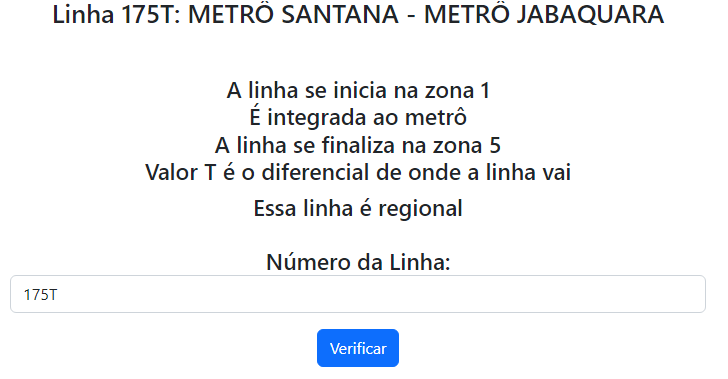
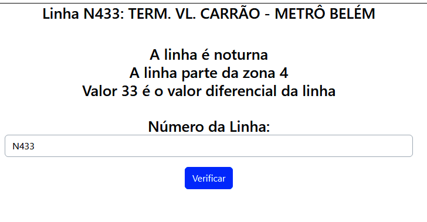

<h1> SPTransAPI-busSearch <h1>
É uma aplicação que utiliza-se da API Olho Vivo da SPTrans para uma pesquisa de ônibus, seus atributos e linhas

# Formato necessário de input
<code>xxxx</code> ou <code>xxxx-xx</code>
 
# Itens/Linguagem Utilizada
 

  

# Imagens do projeto

    
    
    
    

 
# Para utilizar o projeto deve ser feito a seguinte sequência
<code>git clone https://github.com/Gustavo-Henrique-da-Silva/SPTransAPI-busSearch</code>
<code>php -S localhost:xxxx -t src</code>

# Utilizar a API Olho Vivo
Crie uma conta na <a href="http://www.sptrans.com.br/desenvolvedores/Cadastro.aspx"> área de desenvolvedores da SPTrans </a>
Após isso, você terá a opção de desenvolver um app, faça-o, e logo após tê-lo concluido, será feito um token, este será seu token
Para visualizar toda a documentação e ter mais informações da API, <a href="https://www.sptrans.com.br/desenvolvedores/api-do-olho-vivo-guia-de-referencia/documentacao-api/"> clique nesse link </a>

# Atenção
Quase todo o código foi feito exatamente por mim, exceto o SPTrans.php, que me inspirei e utilizei o código do usuário do Github chamado <a href="https://github.com/aspinella/Sptrans-php"> aspinella neste repositório </a>